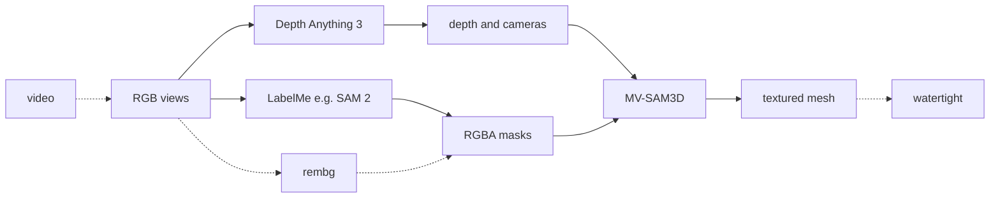

# mv-sam3d-pipeline

This repository reconstructs a textured 3D mesh of a single object from multi-view RGB images or video, as an alternative to modeling the object by hand in CAD.

It is based on [MV-SAM3D](https://github.com/devinli123/MV-SAM3D) and [SAM 3D Objects](https://github.com/facebookresearch/sam-3d-objects). [Depth Anything 3](https://github.com/ByteDance-Seed/Depth-Anything-3) (depth and cameras) and object masks from [LabelMe](https://github.com/labelmeai/labelme) (e.g. [SAM 2](https://github.com/facebookresearch/sam2)) or [rembg](https://github.com/danielgatis/rembg) are optional when those inputs are already available. `--seal` writes a watertight solid.

## Paper

- [MV-SAM3D](https://arxiv.org/abs/2603.11633) — arXiv:2603.11633
- [SAM 3D](https://arxiv.org/abs/2511.16624) — arXiv:2511.16624
- [Depth Anything 3](https://arxiv.org/abs/2511.10647) — arXiv:2511.10647



`--coacd` sits after `--seal`.

**Input**


**Output**


[`examples/gripper/output/mesh.glb`](examples/gripper/output/mesh.glb) is a checked-in result. The CLI writes `output/<scene>/mesh.glb`.

## Data Format

```text
examples/gripper/
  raw/                 # 00.png + 00.json, 01.png + 01.json, …
  processed/           # what MV-SAM3D reads
    images/0.png …     # RGB (stems are 0, 1, 2, … not 00)
    object/0.png …     # RGBA, same names as images/; alpha is the object
  output/
    mesh.glb
    mesh.png
```

`processed/` is the scene the CLI reads: one RGB per view in `images/`, one RGBA mask per view in `object/`, same filename, same count. Alpha must have some foreground. `raw/00.png` becomes `images/0.png` after ingest.

A `raw/` folder is either LabelMe (every still has a `.json`) or rembg (no JSON). Build `processed/` with the converters in `helpers` (`convert_stills_to_images`, `convert_video_to_frames`, `convert_labelme_to_masks`, `convert_rembg_to_masks`, `crop_views_to_masks`).

## Installation

The commands below assume the driver venv is active (`source .venv/bin/activate`). That venv is converters, tests, and `--seal` / `--coacd` only.

```bash
uv venv .venv
source .venv/bin/activate
uv pip install -r env/pipeline-venv.txt
```

To reconstruct a mesh you also need the GPU stack (DA3, MV-SAM3D, weights) in a separate env, plus the two upstream clones next to `pipeline.py`. That is all in [SETUP.md](SETUP.md). `SAM3D_PYTHON` is that env’s `python`.

## Quick Start

```bash
export SAM3D_PYTHON=/path/to/sam3d-objects/bin/python

python pipeline.py -i examples/gripper/processed --scene gripper
```

Writes `work/gripper/` and `output/gripper/mesh.glb`. `-i` is a processed scene (`images/` + `object/`). `--scene` is only that folder name (default: the input folder’s name, here `processed`). If you already have DA3’s `da3_output.npz` (depth, `K`, poses), pass `--da3-npz` and DA3 is not run.

```bash
python -m pytest tests
```


## Seal and CoACD

`--seal` keeps the largest connected component, fills holes, and writes `sealed.stl` (one closed solid).

`--coacd` runs `--seal` first, then convex-decomposes at concavity `t=0.05` into `convex_parts/`. That is for multi-body collision; on the gripper the fingers stay separate. Raise `t` if pieces that should be one body are split; lower `t` if pieces that should be separate are fused.

See also [SETUP.md](SETUP.md) and [EXPERIMENTS.md](EXPERIMENTS.md).

## Citation

```bibtex
@article{li2026mv,
  title={MV-SAM3D: Adaptive Multi-View Fusion for Layout-Aware 3D Generation},
  author={Li, Baicheng and Wu, Dong and Li, Jun and Zhou, Shunkai and Zeng, Zecui and Li, Lusong and Zha, Hongbin},
  journal={arXiv preprint arXiv:2603.11633},
  year={2026}
}

@article{sam3dteam2025sam3d3dfyimages,
  title={SAM 3D: 3Dfy Anything in Images},
  author={SAM 3D Team and Xingyu Chen and Fu-Jen Chu and Pierre Gleize and Kevin J Liang and Alexander Sax and Hao Tang and Weiyao Wang and Michelle Guo and Thibaut Hardin and Xiang Li and Aohan Lin and Jiawei Liu and Ziqi Ma and Anushka Sagar and Bowen Song and Xiaodong Wang and Jianing Yang and Bowen Zhang and Piotr Doll\'{a}r and Georgia Gkioxari and Matt Feiszli and Jitendra Malik},
  year={2025},
  eprint={2511.16624},
  archivePrefix={arXiv},
  primaryClass={cs.CV},
  url={https://arxiv.org/abs/2511.16624}
}

@article{depthanything3,
  title={Depth Anything 3: Recovering the visual space from any views},
  author={Haotong Lin and Sili Chen and Jun Hao Liew and Donny Y. Chen and Zhenyu Li and Guang Shi and Jiashi Feng and Bingyi Kang},
  journal={arXiv preprint arXiv:2511.10647},
  year={2025}
}
```


## License

[MIT](LICENSE)