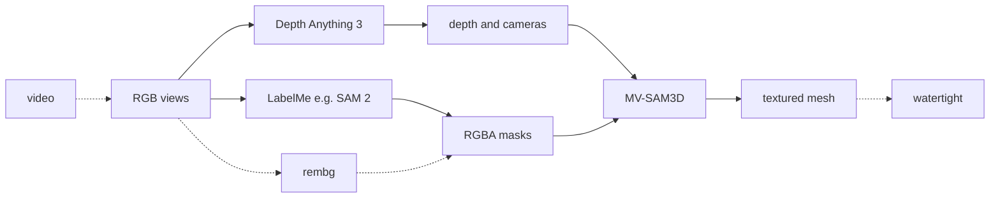
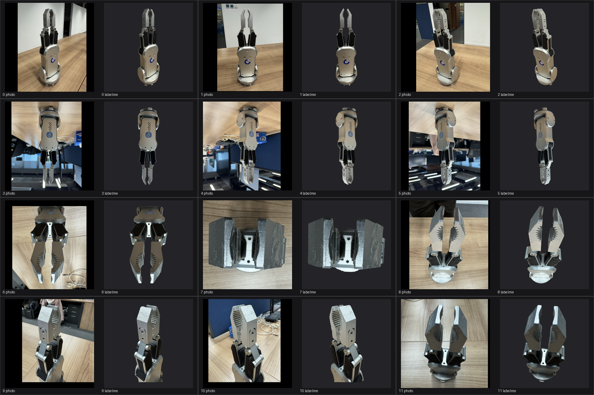
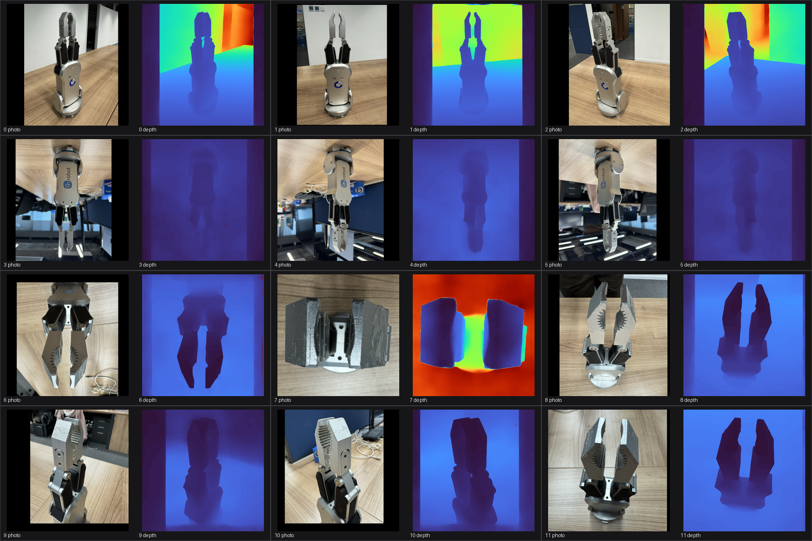
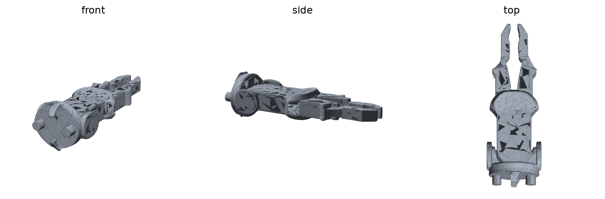
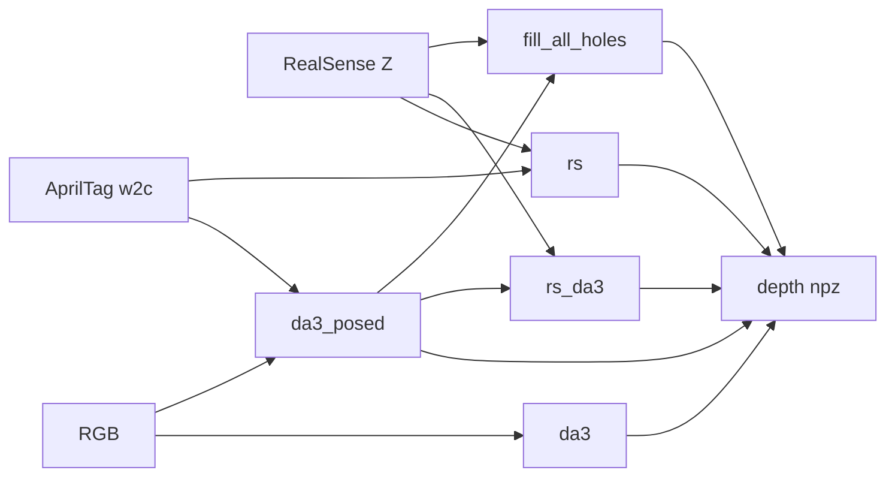

# mv-sam3d-pipeline

This repository reconstructs a textured 3D mesh of a single object from multi-view RGB images or video, as an alternative to modeling the object by hand in CAD.

It is based on [MV-SAM3D](https://github.com/devinli123/MV-SAM3D) and [SAM 3D Objects](https://github.com/facebookresearch/sam-3d-objects). [Depth Anything 3](https://github.com/ByteDance-Seed/Depth-Anything-3) (depth and cameras) and object masks from [LabelMe](https://github.com/labelmeai/labelme) (e.g. [SAM 2](https://github.com/facebookresearch/sam2)) or [rembg](https://github.com/danielgatis/rembg) are optional when those inputs are already available. `--seal` writes a watertight solid.

## Paper

- [MV-SAM3D](https://arxiv.org/abs/2603.11633) — arXiv:2603.11633
- [SAM 3D](https://arxiv.org/abs/2511.16624) — arXiv:2511.16624
- [Depth Anything 3](https://arxiv.org/abs/2511.10647) — arXiv:2511.10647



`--coacd` sits after `--seal`. Driver scripts live in `src/` (`python src/pipeline.py`). Clones, `env/`, and `patches/` stay at the repo root.

**Input**



**Depth**



**Output**



[`examples/gripper/output/mesh.glb`](examples/gripper/output/mesh.glb) is a checked-in result. The CLI writes `output/<scene>/<method>/mesh.glb` (dataset, then depth/mesh).

## Data Format

```text
examples/gripper/
  raw/                 # 00.png + 00.json, 01.png + 01.json, …
  processed/           # what MV-SAM3D reads
    images/0.png …     # RGB (stems are 0, 1, 2, … not 00)
    object/0.png …     # RGBA, same names as images/; alpha is the object
  output/                 # checked-in example
    crop_preview.png
    depth_preview.png
    masks_preview.png
    mesh.glb
    mesh.png
```

`processed/` is the scene the CLI reads: one RGB per view in `images/`, one RGBA mask per view in `object/`, same filename, same count. Alpha must have some foreground. `raw/00.png` becomes `images/0.png` after ingest.

A `raw/` folder is either LabelMe (every still has a `.json`) or rembg (no JSON). Build `processed/` with the converters in `helpers` (`convert_stills_to_images`, `convert_video_to_frames`, `convert_labelme_to_masks`, `convert_rembg_to_masks`, `crop_views_to_masks`).

The CLI also writes `depth_preview_orbit.png` (object-only 3-view cloud) and `depth_visibility_preview.png` (cyan = object and Z>0, red = object and Z=0) when masks exist. AprilTag runs write `tags_preview.png`. Dataset stills previews are always **3 columns**. Each cell is a pair (`photo | overlay`). Every view in the dataset is shown. `mesh.png` and `depth_preview_orbit.png` are 3-view 3D stills, not that grid.

`src/capture_realsense.py` writes those dumps into `input/captures_*` (SPACE to save). Aligned RealSense dumps (`{stem}_rgb.png`, `{stem}_depth.png`, `{stem}.json`, optional `{stem}_rgb.json`) go through `convert_realsense_dump`, then `tags.convert_apriltag_to_da3_npz`, then `crop_views_depth_to_masks`. Pass the cropped npz to `src/pipeline.py --da3-npz`. The depth orbit PNG (`depth_preview_orbit.png`) is object-mask pixels only by default (`object/` alpha). `visualize_depth(..., orbit_z_min=, orbit_z_max=)` clips that orbit camera Z only; `--full-orbit` plots the whole frame.

`src/tsdf.py` fuses that same DA3-style npz with Open3D (metric depth, world-to-camera). Optional RGBA masks zero table depth. Pixels with `Z = 0` (empty wells) never update the volume, so holes do not need to be cut in the mask. `--voxel-length`, `--sdf-trunc`, and `--depth-trunc` are required. `--keep-largest` drops flyer components and does not fill holes.

`src/da3_posed.py` runs Depth Anything 3 with those PnP `w2c` + `K` (`align_to_input_ext_scale`). Pose-free DA3 is still the default in `src/pipeline.py`. The mesh to download is `mesh.glb`; `mesh.png` is the three-view still.

## Depth

How the depth npz can be built. The main pipeline above is unchanged (`da3` is still the default).



- **da3** — pose-free DA3 (default). RGB + masks only; no tags required.
- **da3_posed** — DA3 with AprilTag cameras (`--pose-npz`). Use this when tags exist.
- **rs** — D415 Z + PnP, as measured.
- **rs_da3** / **fill_all_holes** — keep RS where `Z>0`; fill remaining object pixels with posed DA3 scaled by median `RS/DA3`. Same math; `fill_all_holes` is stored as `hybrid`.

## Mesh

`--mesh sam3d` (default) is **generation** (MV-SAM3D). `--mesh tsdf` is **reconstruction** (Open3D TSDF on the same npz). Do not call TSDF “constructive” — that word means CSG.

| You have | Run |
|---|---|
| RGB + masks only (gripper) | `--method da3 --mesh sam3d` |
| Tags, pretty closed box | `--method da3_posed --mesh sam3d` |
| Tags + RS, measured holes | `--method rs --mesh tsdf` |
| Tags + RS, fill RS holes in **depth** | `--method fill_all_holes` then TSDF (not another SAM3D) |

## Installation

The commands below assume the driver venv is active (`source .venv/bin/activate`). That venv is converters, tests, and `--seal` / `--coacd` only.

```bash
uv venv .venv
source .venv/bin/activate
uv pip install -r env/pipeline-venv.txt
```

To reconstruct a mesh you also need the GPU stack (DA3, MV-SAM3D, weights) in a separate env, plus the two upstream clones next to `src/` (repo root). That is all in [SETUP.md](SETUP.md). `SAM3D_PYTHON` is that env’s `python`.

## Quick Start

```bash
export SAM3D_PYTHON=/path/to/sam3d-objects/bin/python

python src/pipeline.py -i examples/gripper/processed --scene gripper
```

Writes `work/gripper/` and `output/gripper/mesh.glb`. `-i` is a processed scene (`images/` + `object/`). `--scene` is only that folder name (default: the input folder’s name, here `processed`). If you already have DA3’s `da3_output.npz` (depth, `K`, poses), pass `--da3-npz` and DA3 is not run.

```bash
python -m pytest tests
```

## Seal and CoACD

`--seal` keeps the largest connected component, fills holes, and writes `sealed.stl` (one closed solid).

`--coacd` runs `--seal` first, then convex-decomposes at concavity `t=0.05` into `convex_parts/`. That is for multi-body collision; on the gripper the fingers stay separate. Raise `t` if pieces that should be one body are split; lower `t` if pieces that should be separate are fused.

## Runtime

Default gripper path (`da3` → SAM3D), 12 views, **10 repeats**, NVIDIA RTX PRO 6000 Blackwell. Mean ± sample sd. Repeat runs live in `archive/gripper_timed/` (not the checked-in example).

**Result.** End to end is **138.4 ± 2.0 s** (~11.5 s/view). SAM3D is most of that (**121.5 ± 2.1 s**). DA3 is **11.1 ± 0.2 s** (~0.93 s/view). Depth is repeatable (RMSE vs run 0 ≈ **0.25 mm**). The mesh is not bitwise-identical — SAM3D is generative (~254k faces ± 1k; chamfer vs run 0 ≈ **8.6 mm ± 0.06 mm**) — but the 10 stills are the same gripper.

| Step | Total (s) | Per view (s) |
|---|---|---|
| DA3 | 11.1 ± 0.2 | 0.93 ± 0.02 |
| depth preview | 4.0 ± 0.2 | — |
| SAM3D | 121.5 ± 2.1 | 10.12 ± 0.18 |
| `mesh.png` | 1.8 ± 0.3 | — |
| **end to end** | **138.4 ± 2.0** | **11.5 ± 0.2** |

## Citation

```bibtex
@article{li2026mv,
  title={MV-SAM3D: Adaptive Multi-View Fusion for Layout-Aware 3D Generation},
  author={Li, Baicheng and Wu, Dong and Li, Jun and Zhou, Shunkai and Zeng, Zecui and Li, Lusong and Zha, Hongbin},
  journal={arXiv preprint arXiv:2603.11633},
  year={2026}
}

@article{sam3dteam2025sam3d3dfyimages,
  title={SAM 3D: 3Dfy Anything in Images},
  author={SAM 3D Team and Xingyu Chen and Fu-Jen Chu and Pierre Gleize and Kevin J Liang and Alexander Sax and Hao Tang and Weiyao Wang and Michelle Guo and Thibaut Hardin and Xiang Li and Aohan Lin and Jiawei Liu and Ziqi Ma and Anushka Sagar and Bowen Song and Xiaodong Wang and Jianing Yang and Bowen Zhang and Piotr Doll\'{a}r and Georgia Gkioxari and Matt Feiszli and Jitendra Malik},
  year={2025},
  eprint={2511.16624},
  archivePrefix={arXiv},
  primaryClass={cs.CV},
  url={https://arxiv.org/abs/2511.16624}
}

@article{depthanything3,
  title={Depth Anything 3: Recovering the visual space from any views},
  author={Haotong Lin and Sili Chen and Jun Hao Liew and Donny Y. Chen and Zhenyu Li and Guang Shi and Jiashi Feng and Bingyi Kang},
  journal={arXiv preprint arXiv:2511.10647},
  year={2025}
}
```

See also [SETUP.md](SETUP.md) (install, `src/` layout, capture) and [EXPERIMENTS.md](EXPERIMENTS.md) (heater jumps, TSDF vs SAM3D).

## License

[MIT](LICENSE)